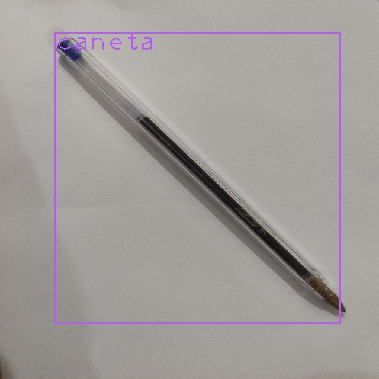

# Objetivo da Atividade
O objetivo desta atividade é preparar o arcabouço inicial para fazer uma mesa digitalizadora com um celular, uma folha de papel em branco e uma caneta. Mas, é importante frisar, o objetivo é fazer apenas a parte de machine learning. A aplicação completa não faz parte do escopo deste trabalho. Os passos requeridos neste trabalho são os seguintes:

1. Elaborar uma pequena base de dados com imagens (80 imagens para treino e 20 para teste) e rótulos (bounding box) dos seguintes alvos:

    a. A ponta da caneta;

    b. Marcadores posicionais usados para alinhar as coordenadas do papel com a da tela de desenho no computador.

2. Converter a base rotulada para o formato YOLO;

3. Treinar e testar o modelo de detecção.

# Construção da Base de Dados
Foram retiradas 100 fotos, 80 utilizadas para treinamento e 20 utilizadas para teste. Todas as imagens foram remodeladas para a resolução 640 x 640 para minimizar o tempo de treinamento.

As 80 fotos utilizadas para treinamento foram anotadas utilizando labelImg (https://github.com/heartexlabs/labelImg)

# Treinamento do Modelo
O treinamento foi realizado no google colab utilizando a YOLO_v3 e o código está presente no algoritmo "Train_YoloV3_.ipynb".

# Teste do Modelo
O teste do modelo foi realizado com o script "yolo_object_detection.py" e em todas as 20 imagens utilizadas como teste foram detectadas, os resultados estão na pasta "teste".

